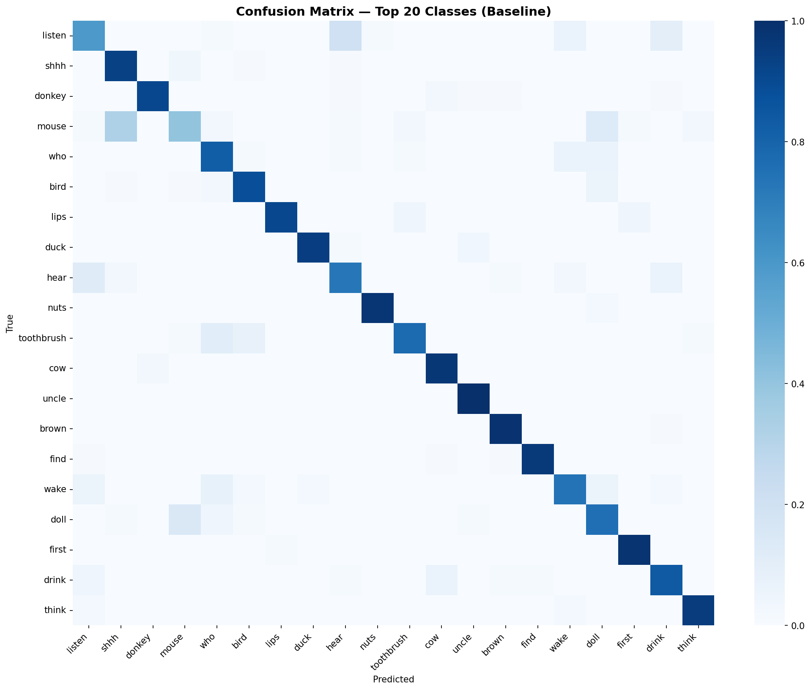
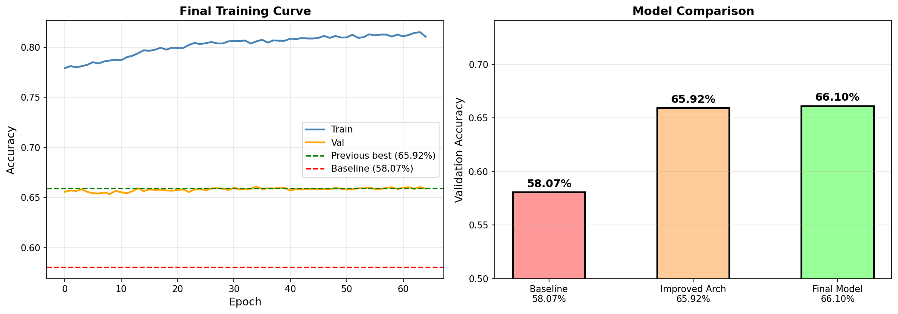
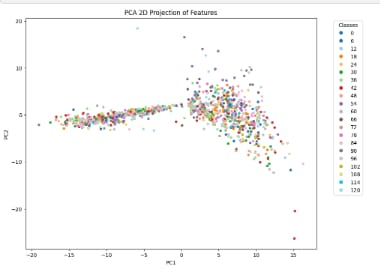

# SignSplit – Dual-Path ASL Recognition Framework with motion-based routing between specialized static and temporal models.

This project is inspired by the Google Isolated Sign Language Recognition Kaggle competition.
A real-time **American Sign Language (ASL) recognition system** that classifies **250 isolated signs** using MediaPipe hand landmarks and deep learning models.  
The system separates **static and dynamic gestures** using a motion-based routing mechanism and maintains a **lightweight model footprint (<25 MB)** for efficient deployment.

---

## Project Overview

Sign language recognition systems can improve accessibility and communication for the **Deaf and Hard-of-Hearing community**.

This project implements an **isolated ASL sign recognizer** trained on the **Google Isolated Sign Language Recognition dataset**, which contains **~95,000 sign videos** performed by **21 Deaf signers** across a **250-sign vocabulary**.

Static and dynamic gestures require different feature representations.  
To address this, SignSplit introduces a **dual-path architecture** that routes inputs to specialized models depending on motion patterns.

---

## Demo (Coming Soon)

This section will include:

- Real-time ASL recognition demo GIF  
- System architecture diagram  
- Example prediction outputs with confidence scores  

## Results (Static Sign Recognition)

### Baseline Confusion Matrix

  

### Final Model Performance

  

---

## Feature Space Visualization

To understand how well the extracted features separate different sign classes, we projected the high-dimensional feature vectors into 2D using Principal Component Analysis (PCA).

  

The visualization shows clusters corresponding to different sign classes in the reduced feature space. While some overlap exists, the projection indicates that the learned representations capture meaningful structure in the dataset.

---

## Key Features

- Supports **250 ASL gestures**
- Handles both **static and dynamic signs**
- Uses **MediaPipe hand landmark features**
- **Motion-based routing** between specialized models
- Real-time webcam inference pipeline
- **Model size <25 MB** for lightweight deployment

---

## System Architecture

The recognition pipeline consists of the following stages:

1. **Input Capture**
   - Webcam frames captured using OpenCV.

2. **Feature Extraction**
   - MediaPipe extracts **hand landmark coordinates**.

3. **Motion Router**
   - Maintains a **30-frame rolling buffer** of landmarks.
   - Computes frame-to-frame displacement to estimate motion.

4. **Model Routing**
   - Low motion → Static Gesture Model  
   - High motion → Dynamic Gesture Model  

5. **Prediction Layer**
   - Outputs gesture predictions with confidence scores.
   - Prediction smoothing improves stability during real-time inference.

---

## Approach

Instead of training a single model for all gestures, the system follows a **mixture-of-experts style architecture**:

- A **motion-based router** determines whether a gesture is static or dynamic.
- The input is then dispatched to a specialized model for classification.

This approach improves efficiency and prevents a single model from needing to learn both **spatial and temporal gesture patterns simultaneously**.

---

## Models

### Static Gesture Model

Used for gestures with minimal motion.

Architecture experiments included:

- Multi-Layer Perceptron (MLP)
- Residual MLP
- 1D Convolutional Networks

**Performance**
- ~60% validation accuracy

---

### Dynamic Gesture Model

Handles gestures involving temporal motion.

Architecture:

Temporal CNN with stacked 1D convolutions:

512 → 256 → 128 channels

**Performance**

- ~40% validation accuracy  
- Significantly higher than the ~0.8% random baseline

---

## Dataset

This project uses the **Google Isolated Sign Language Recognition dataset** from Kaggle.

Dataset characteristics:

- ~95,000 sign videos
- 250 ASL sign vocabulary
- 21 Deaf signers
- Landmark features extracted using **MediaPipe Holistic**
- Each frame contains **543 landmarks (x, y, z)**

Dataset Source:  
https://www.kaggle.com/competitions/asl-signs

The dataset was created to support **PopSign**, an educational game designed to help parents of Deaf children learn ASL vocabulary.

---

## Tech Stack

- Python  
- PyTorch  
- OpenCV  
- MediaPipe  
- NumPy  

---

## Limitations

- Landmark-based models are sensitive to **tracking errors**
- Reduced accuracy under **poor lighting conditions**
- Dynamic gestures with subtle motion are harder to classify
- Currently uses **only hand landmarks**

---

## Unsuccessful Approaches / Early Experiments

During early experimentation, we explored a multi-tier architecture designed to balance spatial feature extraction, temporal modeling, and efficient attention mechanisms. While conceptually promising, the approach proved computationally expensive and difficult to train effectively under our resource constraints.

### Proposed Architecture

**Tier 1 — Spatial Feature Extraction**

- A lightweight convolutional backbone such as **MobileNet (~4MB)** was considered instead of heavier architectures like **ResNet (~45MB)**.
- The goal was to extract spatial representations efficiently while keeping the model deployable on resource-constrained systems.

**Tier 2 — Temporal Modeling**

- A **GRU-based sequence model** was explored instead of a bidirectional LSTM.
- GRUs were preferred due to their reduced gating structure and lower computational overhead.
- Experiments focused on shallow architectures (1–2 layers) to maintain efficiency.

**Tier 3 — Attention / Reasoning Layer**

- A **Flash Attention–based distillation layer** was proposed to transfer knowledge from higher model layers to a more efficient attention module.
- The motivation was to reduce the quadratic complexity of standard attention (**O(N²)**).
- Flash Attention theoretically offers improved memory efficiency and near-linear scaling, although it introduces its own implementation constraints.
- Both standard attention and Flash Attention variants were considered for comparison.

**Tier 4 — Model Optimization**

- Post-training optimization techniques such as **model quantization** were investigated to reduce inference latency and memory footprint.
- Additional deployment optimizations (e.g., **ONNX conversion**) were also considered.

### Challenges Encountered

- The architecture introduced significant **training complexity** relative to the dataset size and available compute.
- Training required a **large number of epochs** for meaningful convergence.
- Experiments showed **slow accuracy improvements and long per-epoch training times**.

As a result, this approach was not pursued further in the final implementation, and the project shifted toward simpler architectures that allowed faster experimentation and more stable training.

---

## Future Improvements

- CNN-based **image models for static gestures**
- **Transformer-based temporal models**
- Multi-modal fusion (**hand + face landmarks**)
- Dataset expansion with varied lighting conditions
- Sentence-level **continuous sign recognition**

---

## Literature References

The following research papers informed the design decisions and architectural experiments explored in this project:

- **Knowledge Distillation**  
  https://arxiv.org/abs/1503.02531

- **SqueezeNet: AlexNet-level Accuracy with 50x Fewer Parameters**  
  https://arxiv.org/abs/1602.07360

- **MobileNetV2: Inverted Residuals and Linear Bottlenecks**  
  https://arxiv.org/abs/1704.04861

- **Quantization and Training of Neural Networks for Efficient Integer-Arithmetic-Only Inference**  
  https://arxiv.org/abs/1712.05877

- **Perceiver-style Architecture**  
  https://arxiv.org/abs/2211.11701
  
---

## Citation

If you use this dataset, please cite:

Ashley Chow et al.  
**Google – Isolated Sign Language Recognition**, Kaggle 2023  
https://kaggle.com/competitions/asl-signs
